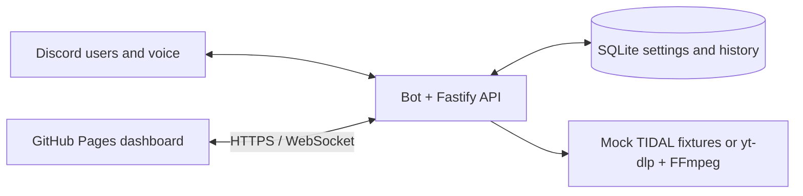

# Discord Music

Private, single-guild Discord music playback with an authenticated web remote. The Node 24
server combines the Discord bot, voice player, Fastify REST/WebSocket API, Discord OAuth, and
SQLite persistence. The SvelteKit dashboard builds to static files for GitHub Pages or a small
container.

Only `DISCORD_OWNER_ID` and users listed in `AUTHORIZED_USERS` can use slash commands or complete
dashboard login, and OAuth also verifies membership in `DISCORD_GUILD_ID`. Sessions, guild
volume, loop mode, playback-source preference, mock-provider connection state, and the latest 200
history items persist. A restart intentionally clears the
current track, queue, and voice connection.

## Architecture



- **Bot and player:** accepts authorized slash commands, maintains one guild queue, and owns the
  Discord voice connection.
- **Fastify API:** performs Discord OAuth, authenticates browser commands, and publishes player
  snapshots over WebSocket.
- **Dashboard:** is a static SvelteKit client; it holds only a short-lived browser session and
  never receives Discord secrets.
- **SQLite and media adapters:** persist settings/history while keeping source selection and local
  Mock TIDAL fixtures separate from YouTube extraction.

## Requirements

- Node.js 24 LTS and pnpm 11.3 or newer
- FFmpeg available as `ffmpeg`
- `yt-dlp` available as `yt-dlp`
- A Discord application and bot installed in one server
- A public HTTPS URL for the API when using Discord OAuth outside localhost

YouTube playback is implemented through the unofficial `yt-dlp` extractor. YouTube can change
without notice; keep `yt-dlp` current and expect occasional extractor breakage. Automated tests
use deterministic fakes and never contact YouTube.

## Mock TIDAL simulator

The dashboard Settings view includes a classroom-safe **Mock TIDAL** provider. Connecting it
prioritizes a small deterministic local catalog and generates private temporary 48 kHz stereo WAV
files for lossless playback. If a search does not match that catalog, the server automatically
falls back to the existing YouTube/`yt-dlp` provider. Select **YouTube only** to bypass the mock
catalog.

This is intentionally not a TIDAL API integration: it sends no TIDAL requests, accepts no TIDAL
credentials, performs no DRM handling, and does not represent access to a subscriber catalog.
Temporary WAV files are created with owner-only permissions and removed during graceful shutdown.
Try the built-in titles `Midnight Circuit`, `Glass Horizon`, or `Indigo Static` after connecting
the simulator.

## Discord application setup

1. In the Discord Developer Portal, create an application and bot.
2. Add the OAuth redirect URL exactly as
   `https://your-api.example/auth/discord/callback`.
3. Install the bot in the target guild with `bot` and `applications.commands` scopes. Grant it
   View Channels, Connect, Speak, and Use Voice Activity in the intended voice channels.
4. Enable no privileged gateway intents; the runtime uses only Guilds and Guild Voice States.
5. Copy `.env.example` to `.env`. Put the owner ID in `DISCORD_OWNER_ID` and any additional
   approved user IDs in the optional comma-separated `AUTHORIZED_USERS` value.
6. Build and register the guild-scoped commands:

   ```sh
   pnpm install --frozen-lockfile
   pnpm build
   pnpm register:commands
   ```

Guild commands normally appear within seconds. Re-run registration after changing command
definitions.

## Configuration

| Variable | Purpose |
| --- | --- |
| `DISCORD_TOKEN` | Bot token used for gateway, voice, membership checks, and registration |
| `DISCORD_CLIENT_ID` | Discord application ID |
| `DISCORD_CLIENT_SECRET` | OAuth client secret, held only by the server |
| `DISCORD_GUILD_ID` | The only guild accepted by commands and API state |
| `DISCORD_OWNER_ID` | Owner user ID, always allowed to control playback |
| `AUTHORIZED_USERS` | Optional comma-separated additional user IDs |
| `FRONTEND_URL` | Exact public dashboard URL, including the Pages repository path |
| `PUBLIC_URL` | Public API base URL used to construct the OAuth callback |
| `DATABASE_PATH` | SQLite file path; missing parent directories are created owner-only |
| `HOST` | Listener address; defaults to `127.0.0.1` |
| `PORT` | Listener port; defaults to `3000` |
| `LOG_LEVEL` | Pino level; defaults to `info` |
| `VOICE_IDLE_TIMEOUT` | Seconds without queued music before leaving voice; defaults to `300` |
| `DISCORD_API_URL` | Optional Discord API override; defaults to API v10 |

Real `.env` files are ignored. Browser builds receive only `VITE_API_URL`; no bot token, OAuth
secret, or session signing material belongs in Pages variables or frontend source. Browser bearer
tokens are stored in `sessionStorage`, expire after eight hours, and are revoked on logout.

## Local development

```sh
pnpm install --frozen-lockfile
cp .env.example .env
set -a; . ./.env; set +a
pnpm dev
```

`pnpm dev` is the bot development command: it builds workspace contracts and the server, then
watches the compiled server entry. Use `pnpm dev:bot` explicitly for the same behavior. The health
endpoint is public and intentionally limited:

```sh
curl http://127.0.0.1:3000/health
```

For the dashboard, use another terminal:

```sh
VITE_API_URL=http://127.0.0.1:3000 pnpm dev:dashboard
```

Set `FRONTEND_URL` to the exact Vite origin. The API checks CORS and WebSocket `Origin`; a mismatch
will reject browser access. OAuth login begins at `GET /auth/discord` on the API.

## Quality gates

```sh
pnpm lint
pnpm format:check
pnpm typecheck
pnpm test
pnpm build
pnpm --filter @discord-music/dashboard test:e2e
```

`pnpm format` applies Biome formatting locally; CI uses the non-mutating `pnpm format:check`.

CI runs the first five commands on Node 24 with a frozen lockfile. Live Discord and YouTube are
not required in CI.

## Updating

1. Stop the deployed service and take a SQLite-aware backup (or copy the database while stopped).
2. Review release notes, then update the checkout and run `pnpm install --frozen-lockfile`; use
   `pnpm update` only for deliberate, reviewed dependency upgrades and commit the regenerated lockfile.
3. Update `yt-dlp` independently (`yt-dlp -U`) or rebuild the image with `docker compose build --pull`.
   Verify `yt-dlp --version` as the service user before restart.
4. For schema changes, add a forward-only migration, test it against a copy of a current database,
   and keep the backup until the service has started successfully. Never edit applied migration SQL.
5. Run `pnpm lint`, `pnpm format:check`, `pnpm typecheck`, `pnpm test`, and `pnpm build`. Then restart
   with `sudo systemctl restart discord-music` or `docker compose up -d` and check `/health`.

## Docker Compose

Fill `.env`, ensuring `PUBLIC_URL` is the externally reachable API URL and `FRONTEND_URL` is the
dashboard URL, then run:

```sh
docker compose up --build -d
docker compose ps
docker compose logs -f server
```

The API is published on port 3000 and the static dashboard on port 4173. SQLite is stored in the
named `music-data` volume. The server image is based on Node 24 Alpine and includes FFmpeg,
`yt-dlp`, and `tini`. Rebuild the image regularly to receive extractor updates.

For upgrades, build first, then replace the containers:

```sh
docker compose build --pull
docker compose up -d
```

The server handles `SIGINT` and `SIGTERM`, leaves voice, closes Fastify and SQLite, and destroys
the Discord client. Compose uses `unless-stopped`; playback does not resume after replacement.

## GitHub Pages

The `Deploy dashboard to GitHub Pages` workflow derives `BASE_PATH` from the repository name,
including the empty-path case for an `owner.github.io` repository. In repository Settings:

1. Set Pages Source to GitHub Actions.
2. Add the Actions variable `PUBLIC_API_URL`, for example `https://music-api.example.com`.
3. Do not add Discord secrets to the Pages environment.
4. Push the `main` branch or dispatch the workflow manually.

For a repository named `discordbot`, configure `FRONTEND_URL` on the server as
`https://OWNER.github.io/discordbot`. The workflow emits the static SPA fallback as `200.html`.

## HTTPS reverse proxy

`deploy/Caddyfile.example` terminates HTTPS and proxies the API to port 3000. Replace both sample
hostnames, install the file, and reload Caddy. Only the API block is needed with GitHub Pages.
Keep `HOST=127.0.0.1` when Caddy runs on the same machine, and allow public inbound traffic only
to ports 80 and 443.

## systemd

Install Node 24, pnpm dependencies, FFmpeg, and `yt-dlp`, then build under
`/opt/discord-music`. Create a locked-down `discord-music` system user and writable storage:

```sh
sudo install -d -o discord-music -g discord-music /var/lib/discord-music
sudo install -m 600 .env /etc/discord-music.env
sudo install -m 644 deploy/systemd/discord-music.service /etc/systemd/system/
sudo systemctl daemon-reload
sudo systemctl enable --now discord-music
```

Set `DATABASE_PATH=/var/lib/discord-music/discord-music.sqlite` in
`/etc/discord-music.env`. Inspect status with `systemctl status discord-music` and structured logs
with `journalctl -u discord-music -f`.

## Operational checks

- `GET /health` reports media dependency status, Discord readiness, voice state, and uptime
  without exposing identifiers or credentials.
- Startup fails before Discord login if FFmpeg or `yt-dlp` is unavailable.
- OAuth state and PKCE verifier live only on the server; the callback fragment contains a
  one-time exchange code, not a bearer session.
- Every protected REST mutation requires a bearer session. WebSocket clients must authenticate
  in their first message within five seconds and originate from `FRONTEND_URL`.
- Logs redact authorization, cookies, tokens, exchange codes, PKCE verifiers, and OAuth secrets.
- Provider settings are protected like every other control. The simulator connection is a local
  boolean preference, not an external account session or stored credential.

## Troubleshooting

**Startup says a media command is missing.** Run `ffmpeg -version` and `yt-dlp --version` as the
service user. Fix `PATH` or install the missing package, then restart.

**YouTube search or playback suddenly fails.** Run `yt-dlp -U` for a standalone installation or
rebuild the container with `docker compose build --pull server`. Confirm the URL directly with
`yt-dlp --dump-single-json --no-playlist URL`. Never paste signed media URLs or cookies into logs.

**A Mock TIDAL search returned YouTube results.** Confirm Settings shows **Simulator connected**
and **Mock TIDAL first**. Only the three documented classroom fixtures match locally; every other
query intentionally falls back to YouTube.

**Discord commands do not appear.** Confirm the application ID and guild ID, then run
`pnpm register:commands` again. Verify the bot was installed with `applications.commands`.

**The bot cannot join or speak.** The invoking user must be in a voice channel. Check Connect and
Speak permissions for the bot and confirm the channel appears in `/api/voice-channels`.

**OAuth returns `invalid_state`.** The state is single-use and held in process memory. Start login
again, especially after a server restart. Confirm the Developer Portal callback exactly matches
`PUBLIC_URL/auth/discord/callback`.

**The dashboard shows disconnected or CORS errors.** `FRONTEND_URL` must match the browser origin
exactly, while `VITE_API_URL` must be the public HTTPS API base. Reverse proxies must pass WebSocket
upgrade headers; Caddy does this automatically.

**SQLite cannot open.** Create the parent directory, grant it to the service user, and verify the
filesystem is writable. The server creates missing parents with owner-only permissions, but it
cannot repair an existing directory owned by another account. Back up the database file only
while the service is stopped or with a SQLite-aware backup command.

## Live acceptance checklist

After supplying real credentials outside version control, verify: unauthorized user rejection;
OAuth login and logout; voice-channel selection; search/play with audible output; pause/resume,
seek, volume, loop, shuffle, queue reorder and duplicates; Discord and dashboard controls staying
in sync; bounded WebSocket reconnect; voice interruption recovery; and a service restart that
restores settings/history while leaving playback, queue, and voice disconnected.
